# Curso - Projeto WhatsApp Clone (Em Andamento)

## 112. W01 - Clonando layout HTML e CSS do Projeto
- Primeira aula fazemos o Git Clone do projeto - curso-javascript-projeto-whatsapp-clone, para iniciarmos as aulas.

## 113. W02 - Criando controle principal do App
- Nessa aula, automatizei o mapeamento de todos os IDs da página para dentro de um objeto no JavaScript, convertendo os nomes automaticamente para camelCase.
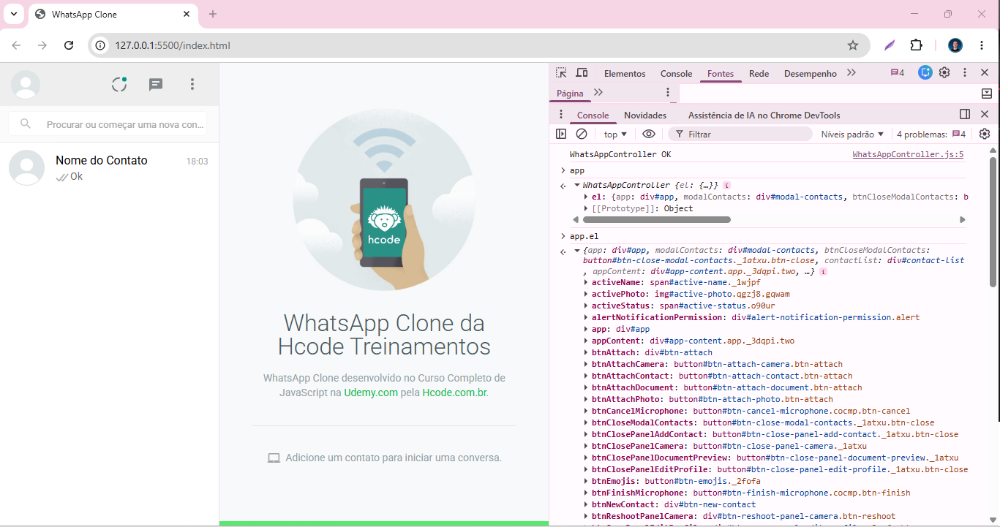

## 114. W03 - Prototype
- Nessa aula, criei atalhos customizados no Element.prototype para facilitar o desenvolvimento. Criei o método .on() para gerenciar múltiplos eventos de uma vez só, o método .css() para aplicar vários estilos em lote, e funções como .addClass() e .removeClass() para manipular classes CSS do HTML de um jeito muito mais rápido e limpo.
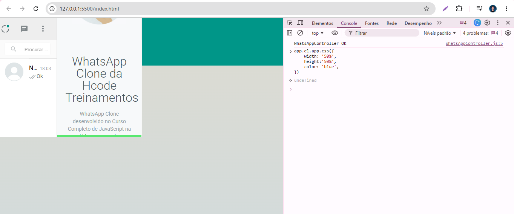

## 115. W04 - Eventos para abrir/fechar os painéis "Editar Perfil" e "Adicionar Contato"
- Nessa aula, melhorei o controle dos painéis criando o método closeAllLeftPanel() para esconder as abas abertas e evitar conflitos. Também apliquei o setTimeout de 300ms para dar tempo ao navegador de processar o .show() antes de rodar o .addClass('open'), garantindo que a animação funcione perfeitamente, e por fim, configurei os botões de voltar para remover a classe e fechar os painéis.
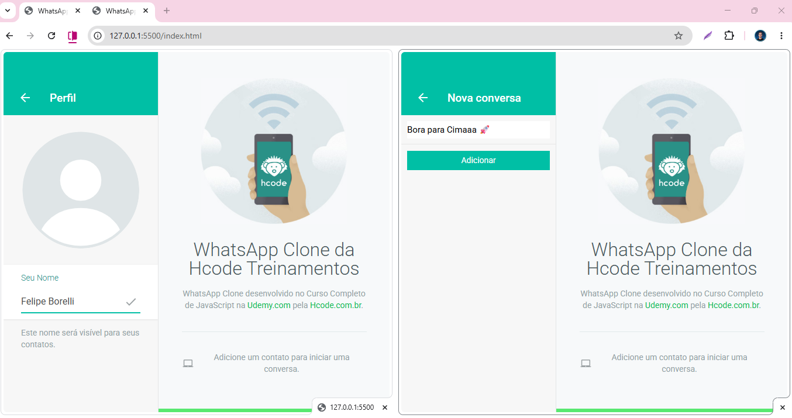

## 116. W05 - Obtendo dados dos painéis e usando FormData
- Nessa aula, adicionei os métodos .getForm() e .toJSON() direto no HTMLFormElement.prototype para facilitar a extração de dados de qualquer formulário em formato JSON. Também vinculei o clique de um container para disparar o input oculto de upload de foto (.click()), configurei o evento de keypress para salvar o perfil automaticamente ao pressionar a tecla 'Enter', e capturei os dados do formulário de novos contatos usando o FormData.
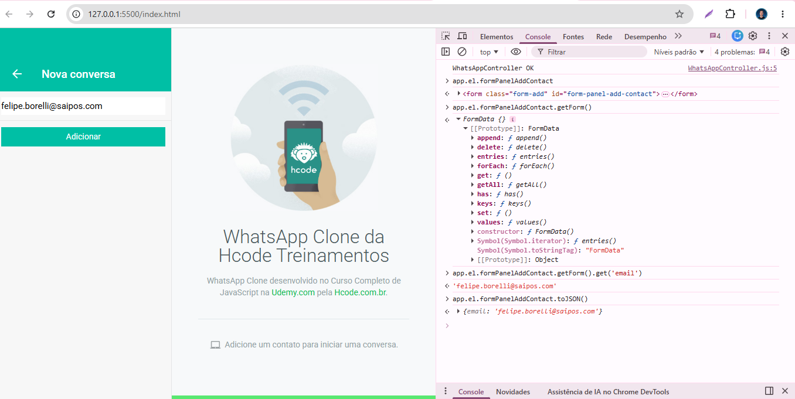

## 117. W06 - Clique no "Menu Anexar" - Usando bind() e removeEventListener()
- Nessa aula, adicionei o evento de clique em btnAttach para abrir o menu de anexos e usei o e.stopPropagation() para controlar o fluxo do clique. Também criei o método closeMenuAttach(e) atrelado ao document com bind(this) para fechar o menu automaticamente ao clicar fora da área, e por fim, estruturei os logs de console para os botões de foto, câmera, documento e contato.
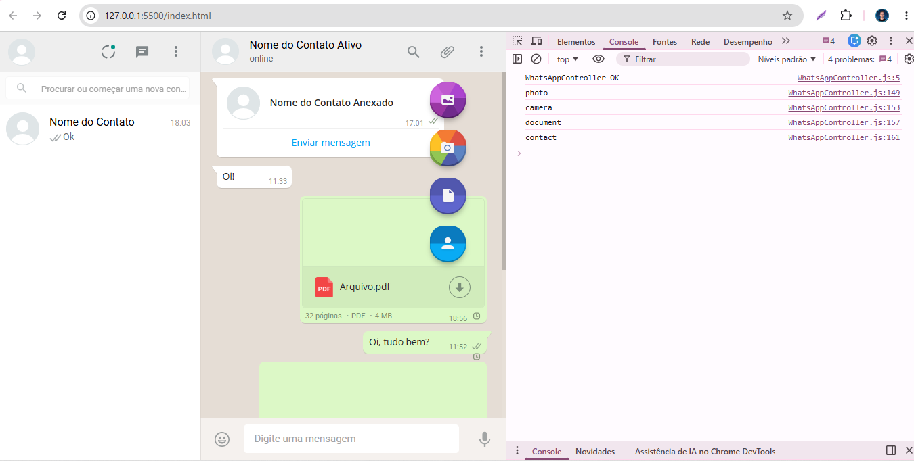

## 118. W07 - Eventos no "Menu Anexar"
- Nessa aula, eu organizei todos os eventos de anexar itens criando o método centralizador closeAllMainPanel(), o que foi ótimo porque evitou que as telas ficassem se sobrepondo uma na outra.
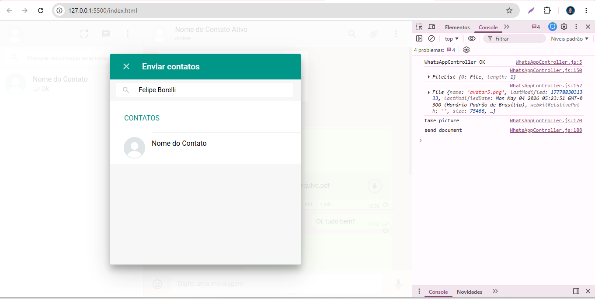

## 119. W08 - Eventos de gravação do microfone e timer de gravação
- Nessa aula o desafio era resolver um problema invisível no gravador de áudio: o consumo desnecessário de memória. O problema é que, mesmo escondendo a barra verde na tela, o cronômetro continuava rodando infinitamente em segundo plano. A solução foi atualizar o método closeRecordMicrophone() com o comando clearInterval(). Com isso, o loop de contagem é destruído assim que o usuário cancela ou envia o áudio, deixando o código otimizado e sem desperdício de performance.
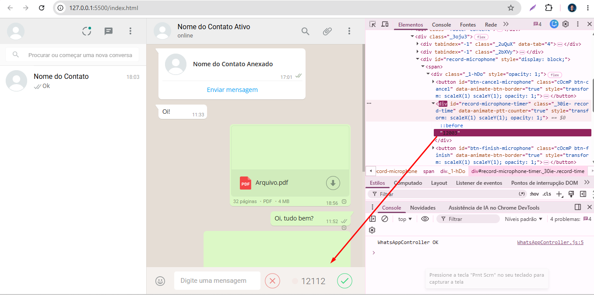

## 120. W09 - Função para formatar milissegundos em minuto e segundo
- Nesta aula ajustamos o gravador de áudio para contar em segundos e minutos.
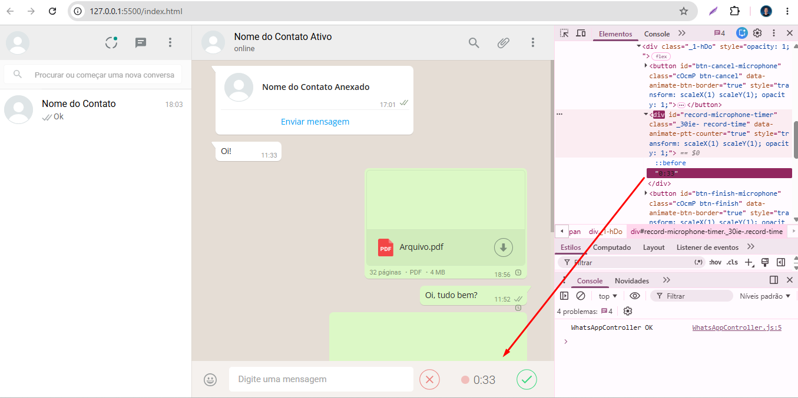

## 121. W10 - Eventos do campo "Digitar Mensagem"
-Nesta aula habilitamos os avatares para ser usado.
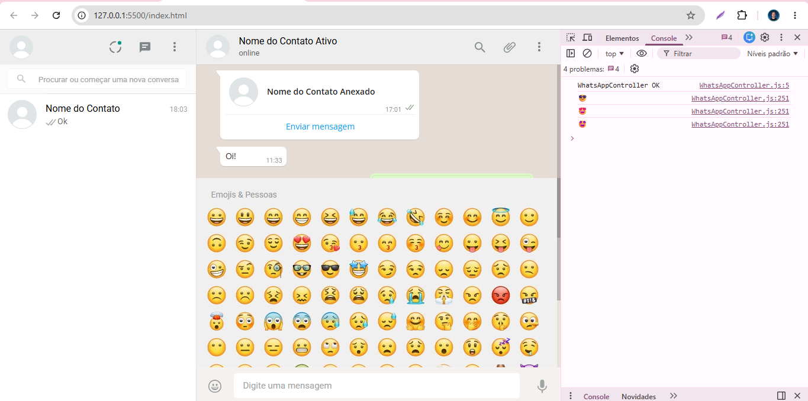

## 122. W11 - Inserir Emoji - cloneNode(), dispatchEvent() e new Event()
- Nessa aula, o emoji foi inserido dentro do campo de texto.
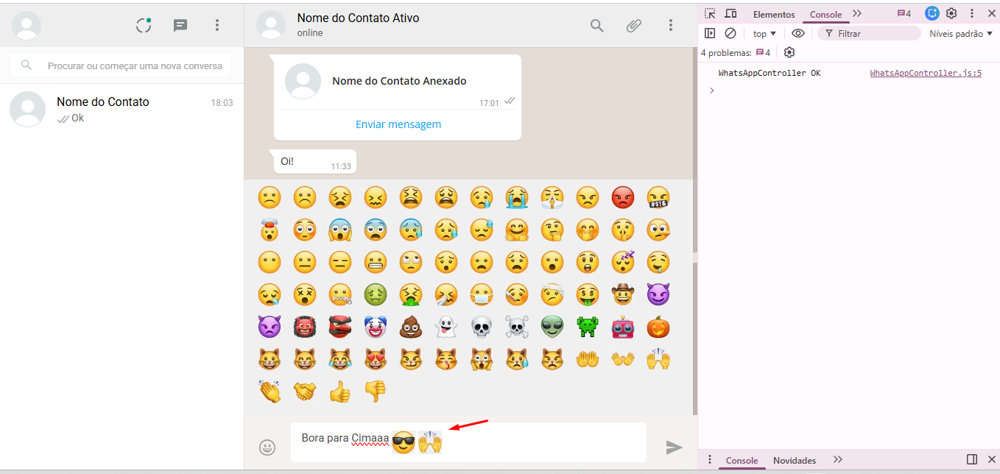

## 123. W12 - Inserir Emoji getSelection(), createRange() e DocumentFragment()
- Nessa aula, o foco foi capturar a posição exata do cursor do usuário no campo de texto e inserir o emogi que foi escolhida.
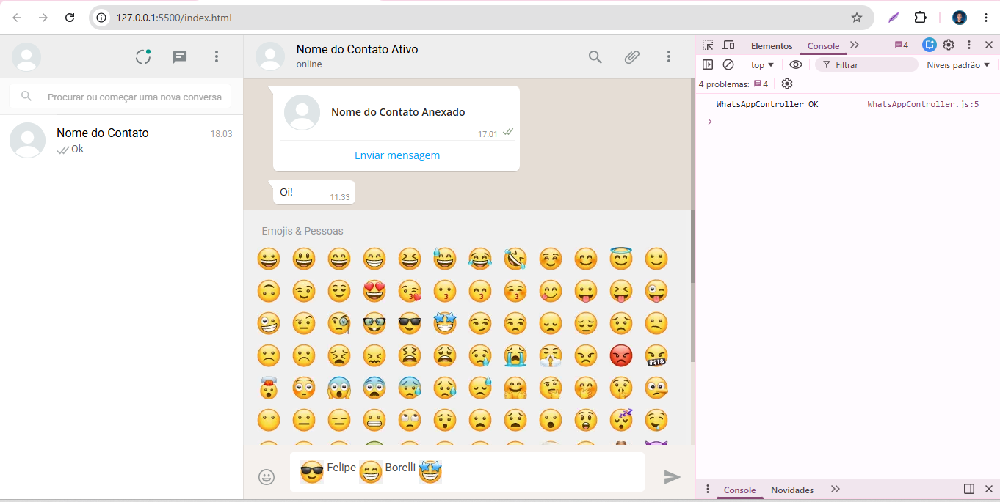

## 124. W13 - Ativando a câmera com API MediaDevices.getUserMedia()
- Nessa aula, a estrutura inicial da classe CameraController foi criada, utilizando a API getUserMedia para pedir permissão de acesso à câmera do usuário e renderizar o fluxo de vídeo direto em um elemento HTML na tela.
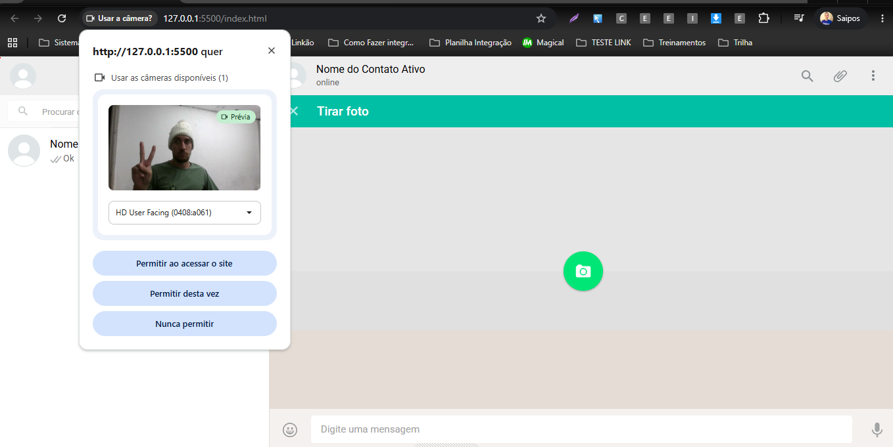

## 125. W14 - Criando um servidor Web com Webpack Dev Server
- Instamos o packageJSON | webpack@3.1.0(node_modules) | webpack-dev-server@2.5.1

## 126. W15 - Arquivo de configuração do Webpack - webpack.config.js
- Nessa aula, foi criada uma pasta Webpack com as dependências para rodar o sistema. Também foram criados os gatilhos de entrada e saída do projeto no webpack.config.js e os scripts no package.json para rodar o build automático e o live reloading direto no terminal.
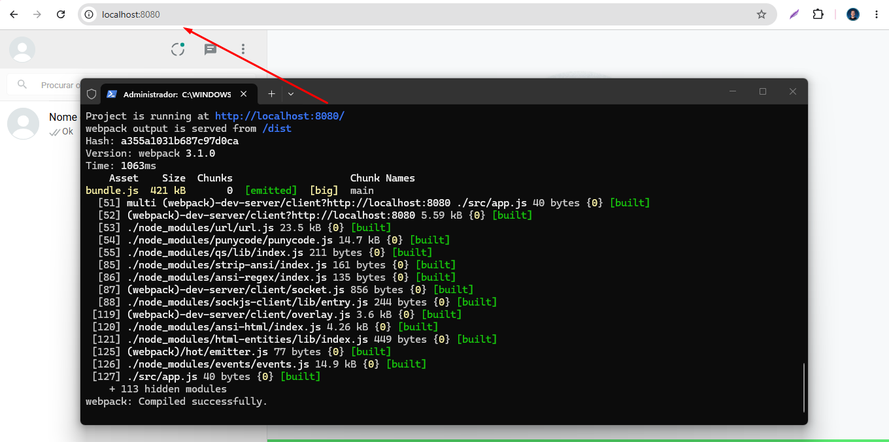